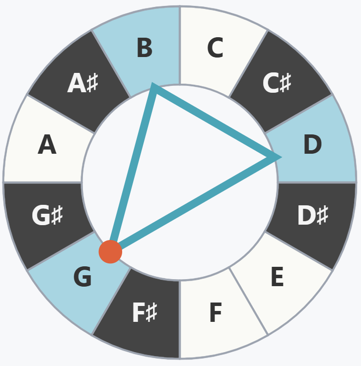
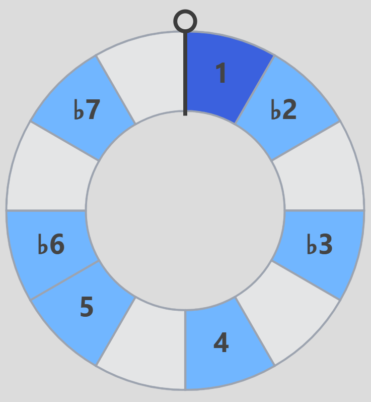

# Music Wheel

MusicWheel is an interactive web application designed to help musicians, students, and music theory nerds explore and understand musical theory concepts. This app features a unique combination of visual and auditory tools, including

- :musical_keyboard: a linear piano keyboard
- a circlular keyboard, based on the concept of a [chromatic circle](https://en.wikipedia.org/wiki/Chromatic_circle)
- :musical_score: a musical staff renderer. Users can interact with these components to select notes, view chord structures, and hear the selected notes played back.

Key features of MusicWheel include:

- Interactive keyboards: linear and circular
- Real-time chord and interval detection and display
- Musical staff rendering of selected notes
- Audio playback of selected notes
- Customizable settings for accidentals and chord display modes
- Preset selector for common chords and intervals

- Musical scales and modes (Ionian, Dorian, Phrygian, etc.)

  

Want to learn music theory, write some tunes, or just play around with how notes work together? Music Wheel is a fun and easy way to explore music and understand how it all fits together.
